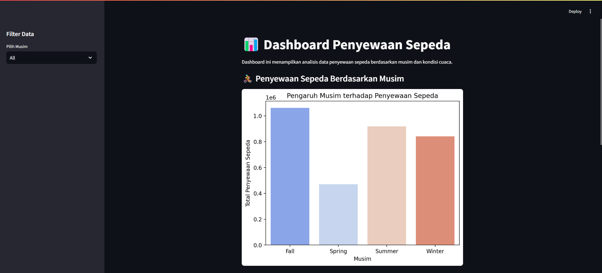

# 🚴‍♂️ Bike Sharing Data Analysis Dashboard

## 📌 Deskripsi Proyek

Proyek ini bertujuan untuk menganalisis data penyewaan sepeda menggunakan **Python**, melakukan **data wrangling & exploratory data analysis (EDA)**, dan membuat **dashboard interaktif dengan Streamlit**.

Dashboard ini menampilkan **insight mengenai pola peminjaman sepeda** berdasarkan **musim dan kondisi cuaca**.

---

## 📂 **Struktur Folder**

📁 submission/ │── 📁 dashboard/ # Folder berisi aplikasi Streamlit │ ├── dashboard.py # File utama untuk dashboard Streamlit │ ├── main_data.csv # Dataset yang sudah dibersihkan │── 📁 data/ # Data mentah yang digunakan │── Proyek_Analisis_Data.ipynb # Notebook untuk analisis dan visualisasi │── requirements.txt # Daftar dependencies untuk proyek │── README.md # Dokumentasi proyek

---

## 🛠 **Teknologi & Library yang Digunakan**

- **Python 3.x**
- **Pandas** → Data wrangling
- **Matplotlib & Seaborn** → Visualisasi data
- **Streamlit** → Dashboard interaktif
- **Virtual Environment** → Manajemen dependensi

---

## 📊 **Hasil Exploratory Data Analysis**

1. **Pola Penyewaan Berdasarkan Musim** 🌦

   - Musim **Fall (Gugur) memiliki jumlah penyewaan tertinggi** dibandingkan musim lainnya.
   - Musim **Spring (Semi) memiliki jumlah penyewaan terendah**.

2. **Pengaruh Cuaca terhadap Penyewaan** ☁️
   - Cuaca **cerah** → Peminjaman sepeda paling tinggi.
   - Cuaca **mendung** → Peminjaman menurun.
   - Cuaca **hujan ringan** → Peminjaman sangat sedikit.

---

## 🚀 **Cara Menjalankan Dashboard**

### **1️⃣ Aktifkan Virtual Environment**

```sh
# Windows (Command Prompt)
venv\Scripts\activate

# Windows (PowerShell)
venv\Scripts\Activate.ps1

# Mac/Linux
source venv/bin/activate

2️⃣ Jalankan Dashboard Streamlit
streamlit run dashboard.py

Dashboard akan terbuka di browser secara otomatis.


```
